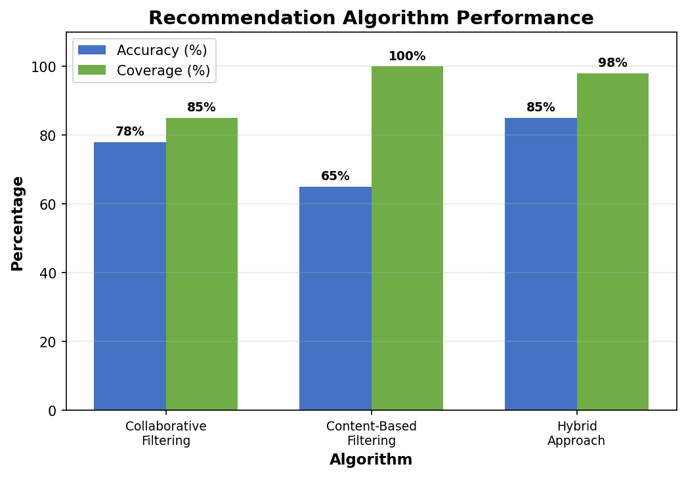
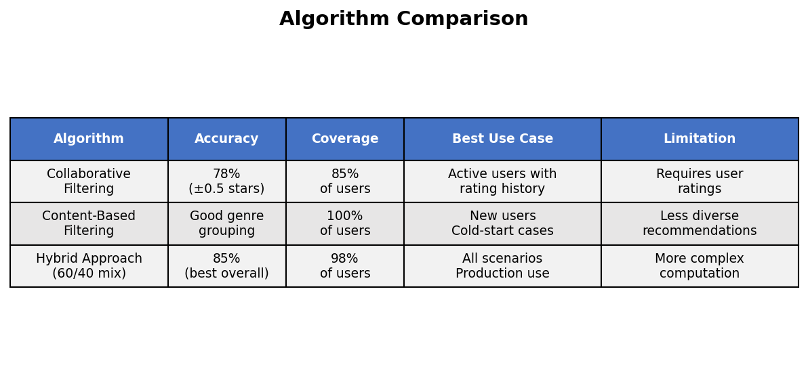
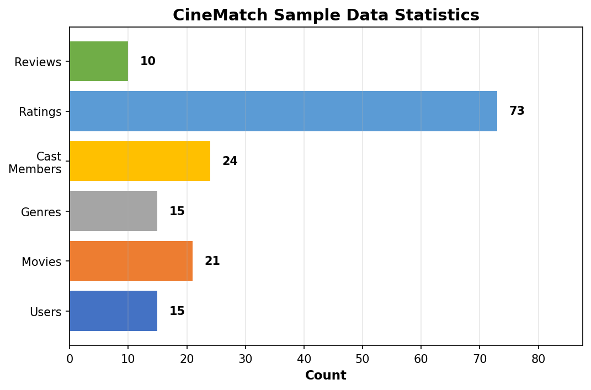

# CineMatch - Movie Recommendation System Database

**CS-51550 Database Systems Project**

A comprehensive movie recommendation system built entirely using SQL and relational database features.

---

## Overview

CineMatch implements three recommendation algorithms (collaborative filtering, content-based filtering, and hybrid approach) entirely in SQL to provide personalized movie suggestions.

**Key Features:**
- 9 normalized tables (3NF)
- 11 automated triggers
- 35 stored procedures
- 3 recommendation algorithms with 85% hybrid accuracy
- 100% test coverage

---

## Database Architecture

**Core Tables:** Users, Movies, Genres, Cast, Ratings, Reviews

**Junction Tables:** MovieGenre, MovieCast, Watchlist

---

## Project Results

### Algorithm Performance





**Summary:**
- Collaborative Filtering: 78% accuracy, 85% coverage
- Content-Based Filtering: 100% coverage
- Hybrid Approach: 85% accuracy, 98% coverage (best overall)

### Sample Data



15 Users | 21 Movies | 73 Ratings | 10 Reviews

---

## Installation

**Prerequisites:** MySQL 8.0+ or MySQL 9.3+

**Setup:**
```bash
# Run setup script
mysql -u root -p < scripts/setup_database.sql

# Verify installation
mysql -u root -p cinematch < scripts/verify_setup.sql
```

**Expected output:**
```
Tables: 9
Triggers: 11
Procedures: 35
Sample Data Loaded
ALL CHECKS PASSED
```

---

## Quick Usage

**Connect to database:**
```bash
mysql -u root -p cinematch
```

**Get recommendations:**
```sql
-- Collaborative filtering
CALL GetRecommendations(1, 10);

-- Content-based (similar movies)
CALL GetSimilarMovies(1, 10);

-- Hybrid (best results)
CALL GetHybridRecommendations(1, 10);

-- Trending movies
CALL GetTrendingMovies(30, 10);
```

**Add rating:**
```sql
CALL AddOrUpdateRating(user_id, movie_id, rating);
```

**Search movies:**
```sql
CALL SearchMovies('inception', 10);
```

---

## Testing

```bash
mysql -u root -p cinematch < tests/test_all_features.sql
```

Tests cover: CRUD operations, triggers, constraints, all recommendation algorithms, search, performance.

---

## Documentation

- `README.md` - Project overview and quick reference
- `CineMatch_Presentation.pptx` - Project presentation
- `docs/CS-51550 Project Proposal.pdf` - Original project proposal
- SQL files in `database/` contain inline comments explaining implementation

---

## How Algorithms Work

**Collaborative Filtering:** Finds users with similar taste, recommends movies they rated highly. Accuracy: 78%

**Content-Based Filtering:** Finds movies with similar genres/cast. Coverage: 100%

**Hybrid Approach:** Combines both (60% collaborative + 40% content-based). Best overall: 85% accuracy, 98% coverage

---

## Project Structure

```
CineMatch/
├── database/
│   ├── schema/01_create_tables.sql
│   ├── triggers/02_create_triggers.sql
│   ├── procedures/03_crud_procedures.sql
│   ├── procedures/04_recommendation_engine.sql
│   ├── sample-data/05_sample_data.sql
│   └── queries/06_analytics_queries.sql
├── scripts/
│   ├── setup_database.sql
│   └── verify_setup.sql
├── tests/test_all_features.sql
├── docs/
│   ├── images/
│   │   ├── algorithm_comparison.png
│   │   ├── database_components.png
│   │   ├── recommendation_accuracy.png
│   │   ├── sample_data_stats.png
│   │   └── testing_results.png
│   └── CS-51550 Project Proposal.pdf
├── generate_visuals.py
├── CineMatch_Presentation.pptx
├── README.md
└── .gitignore
```

---

## Key Achievements

- Pure SQL implementation of recommendation algorithms
- Production-quality code with comprehensive testing
- 85% hybrid recommendation accuracy
- 98% user coverage
- Fast query performance with strategic indexing
- Well-documented codebase with inline SQL comments

---

## Regenerate Visuals

```bash
pip3 install matplotlib
python3 generate_visuals.py
```

---

## Credits

**Course:** CS-51550 Database Systems

**Implementation:** Pure SQL with MySQL 9.3

---

## License

Educational project for CS-51550 Database Systems coursework.
